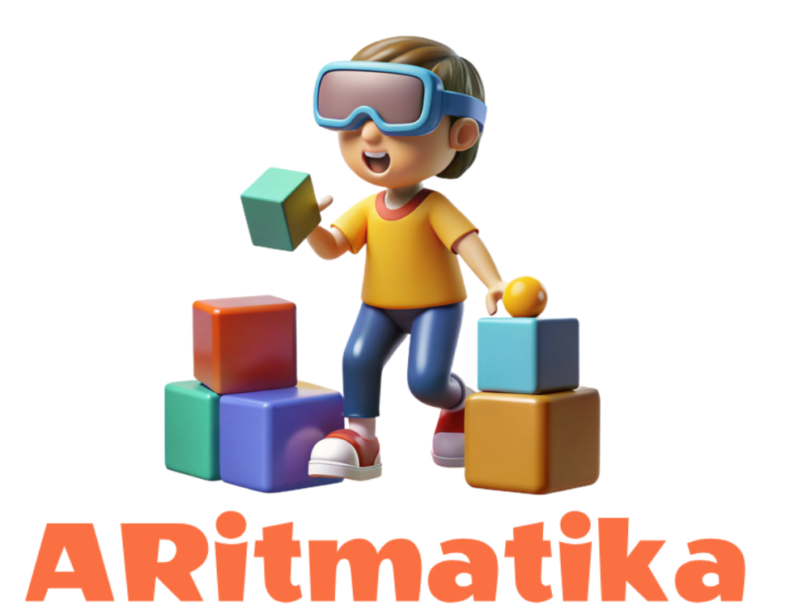

<div align="center">
      <h1> 
            
            <br/>
           Arithmatika
            <br/> 
      </h1>
</div>

<div align="center">
      <h3> 
            🌟 Mujahid Alabdullah - 200541605 🌟
          <br/>
      </h3>
<h4>Porje Dökümanı : <a href= "https://docs.google.com/document/d/1ubI3OFqzkjR_8TAjsisP0jeOMxRGo8e3/edit?usp=sharing&ouid=116800964171632565370&rtpof=true&sd=true">PROJE DOC (SWOT , MARS , THS , UMLS ve SAD dahil )</a></h4>
      <h4>Porje Dökümanı : <a href= "https://mujahid0abdullah.github.io/ARGameView/">PROJE Landing page</a></h4>
</div>

   <br/> 
            
           

   <br/> 

# 🧠 Arithmatika
*Eğitici Artırılmış Gerçeklik (AR) Tabanlı Mobil Oyun*


## ✨ Proje Hakkında

**Arithmatika**, 5–12 yaş arası çocuklar için geliştirilen bir artırılmış gerçeklik (AR) tabanlı mobil eğitim oyunudur. Oyun, matematiksel işlem becerilerini ve dikkat yeteneklerini geliştirmeyi hedeflemektedir. Proje, THY'nin isteği doğrultusunda uçuş sırasında kullanılmak üzere özel olarak tasarlanmıştır.


> **Slogan:** *"Gökyüzünde Matematik, Yanı Başında Eğlence!"*

---

## 📦 Kurulum ve Çalıştırma (Adım Adım)

> Bu adımlar, uygulamayı cihazınıza kurmanız ve çalıştırmanız içindir.

### 1. Projeyi Klonlayın

```bash
git clone https://github.com/kullaniciadi/arithmatika.git
cd arithmatika 
```

### 2. Android Studio ile Açıp Çalıştırabilirsiniz
Android Studio > Open Project > arithmatika
---
## 📦 APK Dosyası
📥 [arithmatika.apk](https://mega.nz/file/TihwXZxI#Ab-_pGJW-Z8VZlsWzx11uVeOk-tvWlAOh1A-zEBitSc) 

Uygulama Android 8.0+ destekli cihazlarda test edilmiştir.


---

## 📷 Uygulama Videosu


🎥 [Demo Videosu İzle](https://mujahid0abdullah.github.io/ARGameView/) 


---

## 📱 Temel Özellikler

- 🎮 **Kişiselleştirilebilir Kaşif Avatarı**
- 🌍 **3D Dünya Haritası Üzerinde Etkileşimli Uçuş Rotası**
- 🧩 **Mini Oyunlar ve Matematik Görevleri (Kolay–Zor)**
- 🧠 **Dikkat Geliştirici Aktiviteler**
- 🗣️ **Dil Öğrenme ve Kültürel Keşif Görevleri**
- 🛡️ **Güvenli Oyun Deneyimi (Ebeveyn Kontrolü, Göz Dinlendirme, Oturma Pozisyonu)**

---

## 🎮 Oyun Modülleri

### ➕ Matematik Görevleri
Çocuklar, verilen sayılarla hedef sonuçlara ulaşmaya çalışır. Kolaydan zora doğru seviye ilerlemesi vardır.

### 🧠 Dikkat Mini Oyunları
AR nesneleriyle şekil eşleştirme, hafıza ve desen tanıma gibi aktiviteler içerir.

### 🌍 Keşif ve Dil Eğitimi
Her ülke için kültürel bilgiler, selamlaşmalar ve sayılar öğretilir. Avatarlar yöresel kıyafetler giyebilir.

---

## 🏗️ Teknolojik Altyapı

| Bileşen            | Teknoloji                              |
|--------------------|-----------------------------------------|
| Platform           | Android                                 |
| Programlama Dili   | Kotlin                                  |
| AR Teknolojisi     | [SceneView AR](https://sceneview.dev)   |
| 3D Modelleme       | TinkerCAD , Blender                     |
| Backend            | Firebase                                |
| Tasarım Araçları   | Figma                                   |
| Sürüm Kontrol      | Git + GitHub                            |
| Proje Yönetimi     | DevOps + trello                         |

---

## 👨‍👩‍👧‍👦 Hedef Kullanıcılar

- 5–12 yaş arası çocuklar  
- Havayolu şirketleri (uçuş içi eğlence için)  
- Okullar ve eğitim kurumları  

---


## 📈 Proje Durumu

> 🚧 **Alfa Sürümünde**  
✅ Prototip Tamamlandı  
🧪 Test Süreci Devam Ediyor  
🧩 Yeni içerikler geliştiriliyor

---
---

## 🗓️ Haftalık Çalışma Takvimi

| Hafta | Tarih Aralığı        | Yapılan Çalışmalar                                   |
|-------|-----------------------|------------------------------------------------------|
| 1     | 15 - 22 Mart 2025     | Proje planlaması, teknoloji seçimi, gereksinim analizi |
| 2     | 23 - 29 Mart 2025     | UI/UX tasarımları, sistem mimarisi belirleme         |
| 3     | 30 Mar - 5 Nisan 2025 | 3D model tasarımları, AR sahne testi                 |
| 4     | 6 - 12 Nisan 2025     | Matematik görev modülü geliştirme                    |
| 5     | 13 - 25 Nisan 2025    | Dikkat oyunu modülü geliştirme, Firebase bağlantısı  |
| 6     | 25 - 29 Nisan 2025    | Kullanıcı arayüzleri, avatar oluşturma ekranları     |
| 7     | 27 Nisan - 3 Mayıs    | Görev entegrasyonu ve seviye sistemi geliştirme      |
| 8     | 4 - 10 Mayıs          | Test planı uygulama: birim testler, kullanıcı testleri|
| 9     | 11 - 17 Mayıs         | Hataların düzeltilmesi, video hazırlıkları           |
| 10    | 18 - 20 Mayıs         | APK üretimi, son kontrol, README ve teslim işlemleri |

---


## 📬 İletişim

Geliştirici: [Mujahıd ALABDULLAH]  
📧 E-posta: 200541605@firat.edu.tr
🔗 [LinkedIn / Kişisel Web Sitesi]

---


<br/> 


